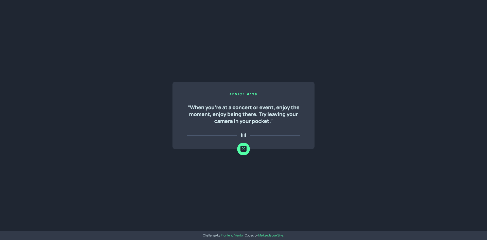
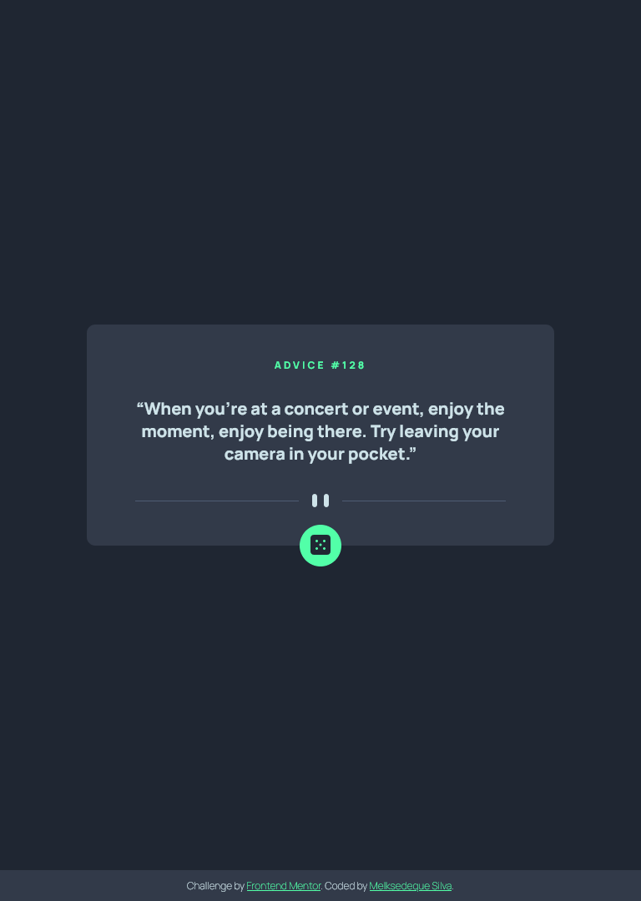
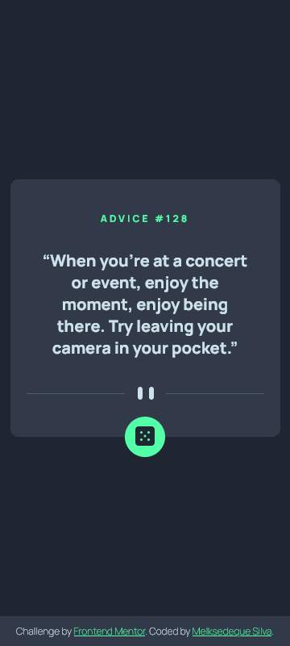

# Frontend Mentor - Advice generator app solution

This is a solution to the [Advice generator app challenge on Frontend Mentor](https://www.frontendmentor.io/challenges/advice-generator-app-QdUG-13db). Frontend Mentor challenges help you improve your coding skills by building realistic projects.

## Table of contents

- [Overview](#overview)
  - [The challenge](#the-challenge)
  - [Screenshot](#screenshot)
  - [Links](#links)
- [My process](#my-process)
  - [Built with](#built-with)
  - [What I learned](#what-i-learned)
  - [Continued development](#continued-development)
  - [Useful resources](#useful-resources)
- [Author](#author)
- [Acknowledgments](#acknowledgments)

**Note: Delete this note and update the table of contents based on what sections you keep.**

## Overview

This project consumes an API from a board generator and returns the ID and text of the board to the user after clicking the button.

As, during development, I noticed that the API could fail at times, I created a second API consumption, from another link, so that when the first link had a problem, the app would seek to consume from the second API, reducing the possibilities of failure to deliver advice.

To run this project, it is not necessary to have a database or a server installed, just clone the repository to your machine and open the index.html file in your browser.

### The challenge

Users should be able to:

- View the optimal layout for the app depending on their device's screen size
- See hover states for all interactive elements on the page
- Generate a new piece of advice by clicking the dice icon

### Screenshots





### Links

- Repository URL: [Repository](https://github.com/Melksedeque/advice-generator-app)
- Live Site URL: [Live Site](https://melksedeque.github.io/advice-generator-app/)

## My process

### Built with

- Semantic HTML5 markup
- CSS custom properties
- Flexbox
- CSS Grid
- Mobile-first workflow
- SASS / SCSS

### What I learned

This project helped me better understand APIs and how to consume them in my JavaScript code. The use of an API can greatly simplify the work when you need to consume external data, without the need to query the database. Even because, you don't always have access to the database when you are developing an application that will fetch data from a system that is not your own.

In addition to learning how to consume an API correctly, in this project I also learned that at times, the browser keeps a cache of data, which interferes when requesting a new advice by clicking on the button.

```js
const timestamp = Date.now()

function getAdvice() {
    fetch(`${linkApi1}?timestamp=${timestamp}`)
    // ... rest of the code
}
```

In this way, using a timestamp, I was able to generate a unique URL when consuming the API, which allows it to be a new URL with each button click, preventing the cache in the browser from generating the same advice over and over again.

### Continued development

This project was my first learning how to consume an API. Now, to continue my development, I will carry out new projects using APIs to better understand this whole process and, in the future, start my studies and development using ReactJS.

### Useful resources

- [How to prevent HTTP caching of REST calls in browser?](https://stackoverflow.com/questions/64331735/how-to-prevent-http-caching-of-rest-calls-in-browser) - This link helped me to solve the browser caching issue when consuming the API. Within the examples contained therein, is what I used in my project. Create a const with Date.now() and add it to the API URL.

## Author

- Website - [Melksedeque Silva](https://github.com/Melksedeque/)
- Frontend Mentor - [@Melksedeque](https://www.frontendmentor.io/profile/Melksedeque)
- Twitter - [@SouzaMelk](https://twitter.com/SouzaMelk)